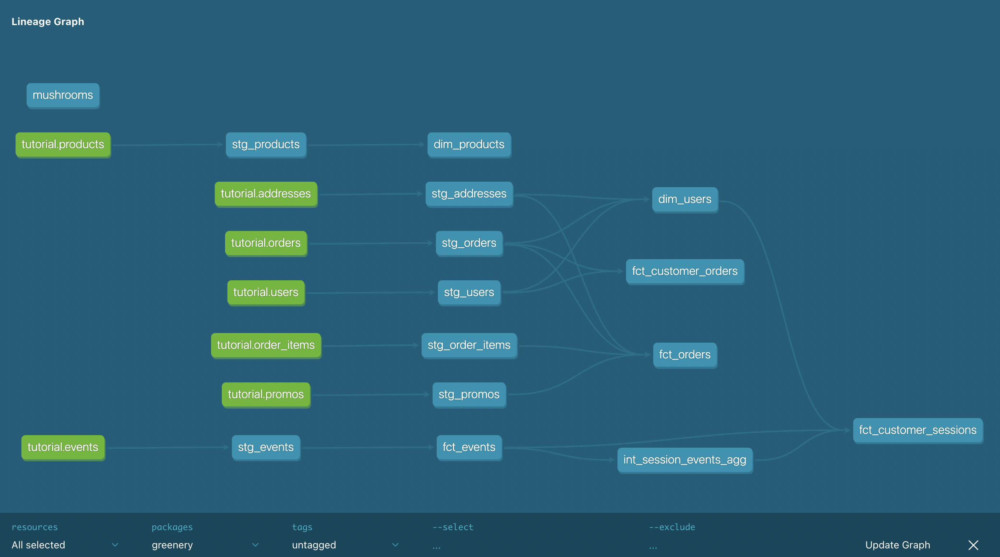

# Week 2 Questions and Answers

## Part 1: Models

### Question 1: 
_What is our user repeat rate?_

**Answer:**
± 79%

```WITH orders_per_user AS (
    SELECT COUNT(CASE WHEN number_of_orders > 0 THEN 1 ELSE 0 END) AS customer_with_at_least_1_order
     , COUNT(CASE WHEN number_of_orders >= 2 THEN 1 ELSE 0 END) AS customers_with_more_than_1_order
    FROM dbt_elisaveta_aleksieva.dim_users
)

SELECT 

(CAST(customers_with_more_than_1_order AS FLOAT) / customer_with_at_least_1_order)*100 AS repeat_rate

FROM orders_per_user

```

### Question 2: 
_What are good indicators of a user who will likely purchase again? What about indicators of users who are likely NOT to purchase again? If you had more data, what features would you want to look into to answer this question?_

**Answer:**
```
- Session frequency and duration - how often do they browse the website and how much time they spend on the website (are they engaged users or do they drop after a short time)
- Number of orders they placed already > the more orders they have placed the more likely is they are a loyal customer and will likely order again. 
- Recency of orders - if they haven't placed an order for a very long time they are probably less likely to order again.
- Shipping on time vs delayed shipping
- Conversion rate - the higher the conversion rate (orders/ sessions) the higher the probability that they order again.
```

```
If we had more data - like customer satisfaction score/ order reviews (after an order) are a type of indicator that can help identify customers who are likely to order or not order again. 
```
### Question 3:
_Explain the marts models you added. Why did you organize the models in the way you did?_

**Answer:**
```
In the core folder, I added two dim tables - users and products and two fact tables - events and orders. 
In the marketing folder, I added one fact table that contains order data aggregated on the customer level. This is to understand which customers are valuable for the business and which ones might need more marketing effort in order to order again.
In the product folder, I added one intermediate table to aggregate the events data, and one prod fact table to combine the aggregated events with user data. The intermediate table can be reused for other purposes as well.
```


## Part 1: Testing

### Question 1:
_What assumptions are you making about each model? (i.e. why are you adding each test?)_

```
Unique and not_null tests: primary keys

Positive values test: financial metrics(cost, revenue, discounts), quantities
```

### Question 2:
_Did you find any “bad” data as you added and ran tests on your models? How did you go about either cleaning the data in the dbt model or adjusting your assumptions/tests?_

**Answer:**

```
No, all tests passed without errors.
```

### Question 3:
_Your stakeholders at Greenery want to understand the state of the data each day. Explain how you would ensure these tests are passing regularly and how you would alert stakeholders about bad data getting through._

**Answer:**
```
Dbt jobs would have to be scheduled on a daily basis and maybe a slack integration added to inform data team in case job fails so they can quickly react and investigate and fix the issue before any stakeholders are affected. Potentially, only an incremental load of new data can be done, so table doens't have to be dropped and recreated and users still have data to work with and not an empty table. 
```
